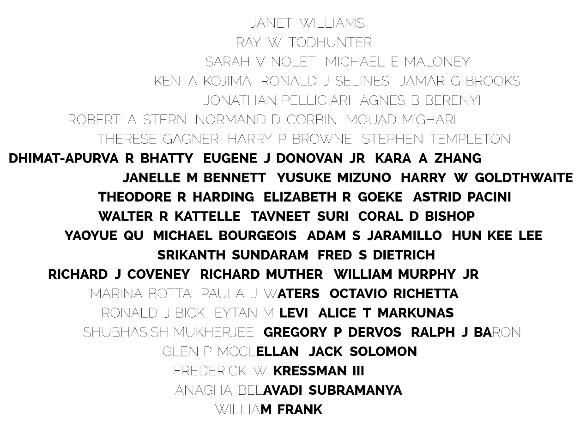

  

    <h1> Design Process  </h1>
    
For every iteration of One.MIT, Prof. W. Craig Carter created the designs, algorithms, numerical solutions, and data translation -- a tremendous undertaking.  

**Placing the names and creating the mosaics**  

Every One.MIT artwork starts from a black and white image:  MIT's Great Dome, drawn by Heidi Erickson (2018); the MIT Seal (2020); an image Carter himself drew, inspired by a lithograph produced for the 1916 celebration of MIT's move from Boston to Cambridge (2024). 

The black and white regions sow the seeds that produce the heavy and light fonts that you see in the final image. For the final layout files, it was necessary for Carter to recreate kerns and the fonts as algorithmic geometric objects. 

The font types are inherited from their position in the background image. Quality typesetting requires the spacing between characters to be “kerned.” For example, the appearance of **LY** looks better when the spacing within the **L** and the **Y** is smaller. **IM** looks better with a wider spacing and so the kern is larger. 

*<a href="https://en.wikipedia.org/wiki/Kerning">Curious about kerning? Learn more at Wikipedia.</a>*

The kerns are different for the different fonts—each character pair has four possible kerns. This produces some complexity because minor adjustments can switch font types that have different widths and kerns. The change in spacing produces a cascading effect on subsequent font choices. Modifying just one letter from light to dark (and vice versa) perturbs the spacing in the whole image and requires re-computing the entire mosaic.

Finally, Carter needed to find a font scale that fills the wafer space maximally. This seems straightforward at first. However, a small font change can cause an entire word to wrap around to the next line (which is familiar to anyone trying to fit an essay into a fixed number of pages). Optimization would be simple if the leftover space smoothly decreased as the font scale gets larger—but the word wrap problem throws a spanner in the works. Carter’s algorithm alleviates this somewhat by searching for names that slot into remaining spaces at the end of each row. Even with these minute fixes, a satisfactory font scale cannot always be obtained. So, the final algorithm performs an optimization over many different choices for the random order of the names. 

Once a solution (i.e., the final image created by the millions of characters) is obtained it must be converted to two different printing languages. For the wafer fabrication, Carter had to write data conversions to the layout file format (GDSII) that was created for interconnects on silicon chips.  For the large wall print, the data is converted to PostScript and then from PostScript to PDF. 

  

  

    <h1> Special features of the designs  </h1>

***One.MIT 2024 - Move to Cambridge***  

Inspired by a 1916 lithograph celebrating the opening of MIT’s then newly-built Cambridge campus, the One.MIT 2024 design achieves its background gradient effect by using a _single continuous line_ that weaves back and forth in a Schwarz-Christoffel mapping of a Hilbert curve.

Carter had to redraw the lithograph’s architectural features and character elements to get clean data representation.

The color gradient representing the sky behind the dome was a challenge because only two shades were available. In true MIT spirit, this challenge provided Carter an opportunity for nerdiness and fun. Two techniques were combined to create the gradient effect.

The first technique to create a Hilbert curve. A Hilbert curve is a hierarchical continuous curve that is created by replacing an element with combination of four elements. Each of these four elements are replaced by another four elements, and so on. The result is a fractal-like object composed on 90-degree turns. The Hilbert curve creates the texture that is the foundation of the gradient for the sky in the final figure. It also will help create a useful reference as you search out a name in ONE.MIT.

To achieve the gradient and the wafer shape, Carter morphed square Hilbert curve into a disk. Maintaining the 90-degree turns provides a pleasing aesthetic element and an opportunity to inject some Complex Analysis nerdiness into the scheme. 

A Conformal Map comes in handy—in this case the Schwarz-Christoffel mapping. Conformal maps can be used to solve problems in electrostatics, gravitational fields, fluid flow, and temperature distributions—they are lovely convergences of physics and engineering with mathematics and geometry.

Because the conformal mapping is smooth and preserves the local angles, the square’s corners produce four singular points on the circle where the Hilbert curve’s line segments shrink to a point. The location of the four points in the upper part of the circle squeezes the curve and creates the gradient: dense-to-sparse from top-to-bottom.

**One.MIT 2020 - The MIT Seal**  

If you look carefully, you may spot an additional motif hidden on the 2020 wafer. Inspired by the beautiful (and intriguingly mathematical) patterns inside a sunflower, known as phyllotaxis, this subtle pattern spirals out over the design.

**One.MIT 2018 - The Great Dome**  

This original image of MIT’s iconic Great Dome was drawn by Heidi Erickson, senior graphic designer in the MIT Center for Art, Science & Technology.

  

  

    <h1> Figure placeholder </h1>
  

