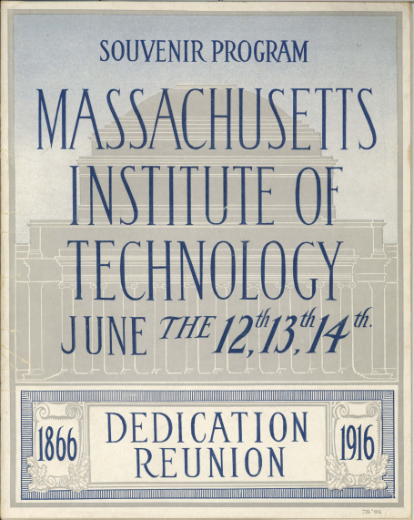
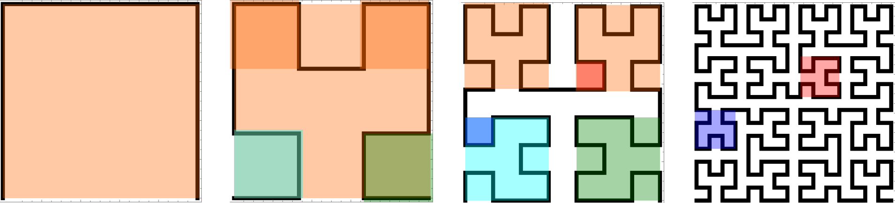
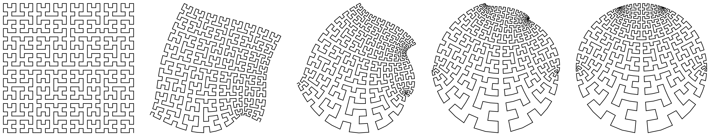
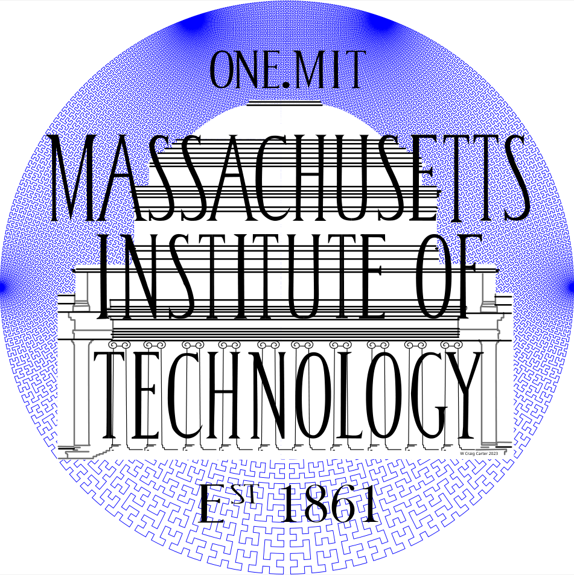

  

    <h1> Special features of the designs  </h1>

Curious about the inspirations and special features behind each One.MIT design? Read on below! 

***One.MIT 2024 - Move to Cambridge***  

Inspired by a 1916 lithograph celebrating the opening of MIT’s then newly-built Cambridge campus, the One.MIT 2024 design achieves its background gradient effect by using a _single continuous line_ that weaves back and forth in a Schwarz-Christoffel mapping of a Hilbert curve.

Carter had to redraw the lithograph’s architectural features and character elements to get clean data representation.

The color gradient representing the sky behind the dome was a challenge because only two shades were available. In true MIT spirit, this challenge provided Carter an opportunity for nerdiness and fun. Two techniques were combined to create the gradient effect.

The first technique to create a Hilbert curve. A Hilbert curve is a hierarchical continuous curve that is created by replacing an element with combination of four elements. Each of these four elements are replaced by another four elements, and so on. The result is a fractal-like object composed on 90-degree turns. The Hilbert curve creates the texture that is the foundation of the gradient for the sky in the final figure. It also will help create a useful reference as you search out a name in ONE.MIT.

To achieve the gradient and the wafer shape, Carter morphed square Hilbert curve into a disk. Maintaining the 90-degree turns provides a pleasing aesthetic element and an opportunity to inject some Complex Analysis nerdiness into the scheme. 

A Conformal Map comes in handy—in this case the Schwarz-Christoffel mapping. Conformal maps can be used to solve problems in electrostatics, gravitational fields, fluid flow, and temperature distributions—they are lovely convergences of physics and engineering with mathematics and geometry.

Because the conformal mapping is smooth and preserves the local angles, the square’s corners produce four singular points on the circle where the Hilbert curve’s line segments shrink to a point. The location of the four points in the upper part of the circle squeezes the curve and creates the gradient: dense-to-sparse from top-to-bottom.

 

**One.MIT 2020 - The MIT Seal**  

If you look carefully, you may spot an additional motif hidden on the 2020 wafer. Inspired by the beautiful (and intriguingly mathematical) patterns inside a sunflower, known as phyllotaxis, this subtle pattern spirals out over the design.

 

**One.MIT 2018 - The Great Dome**  

This original image of MIT’s iconic Great Dome was drawn by Heidi Erickson, senior graphic designer in the MIT Center for Art, Science & Technology. Read more about the very first One.MIT design at MIT News: <a href="https://news.mit.edu/2019/onemit-creates-monument-at-smallest-scale-0318">“One.MIT” creates a monument — at the smallest scale</a>.  

  

  

    <h1> Figure placeholder </h1>
  

